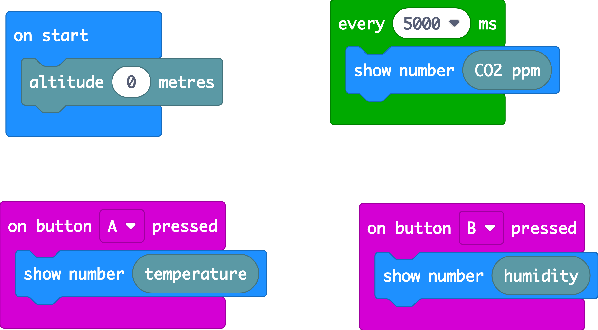
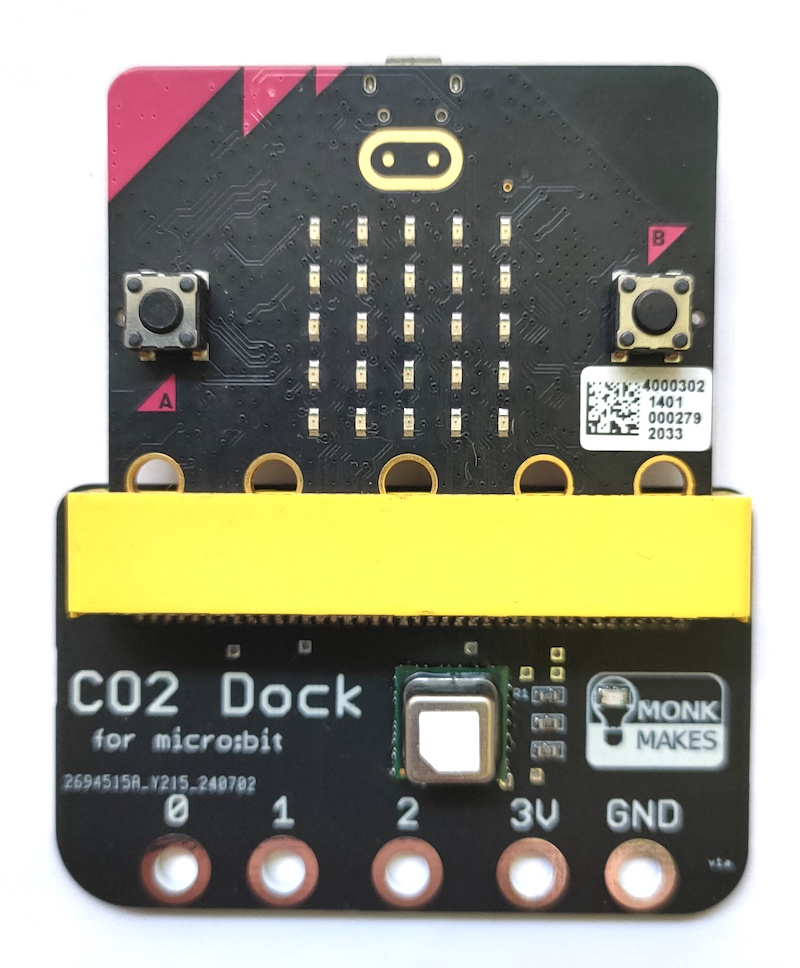

# MonkMakes CO2 Dock / SCD41 Makecode Extension

Makecode extension for the MonkMakes [CO2 Dock](https://monkmakes.com/co2_dock) using the SCD41 Sensiron sensor over I2C with the micro:bit.

Please feel free to use this extension for non-MonkMakes products.

## Usage

open your microbit makecode project, in "+ Extension", paste the following URL:

https://github.com/monkmakes/makecode-extension-scd41

## Demo

## License

[MIT](LICENSE)
